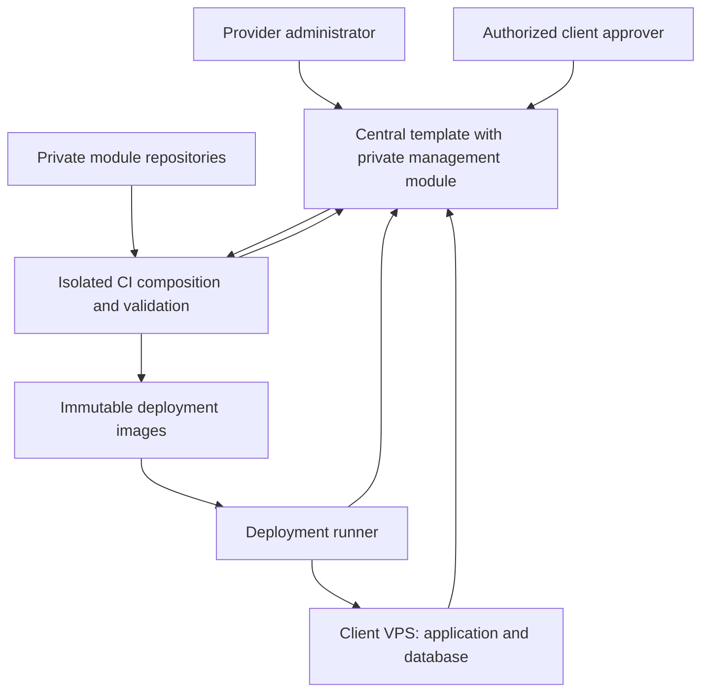

# Client deployments and commercial modules

Status: Proposed architecture, 2026-09-15. This document records agreed product
requirements and recommends an implementation sequence. It does not describe
implemented licensing or approve changes to running deployments.

## Agreed requirements

- Each client has a separate application deployment and database. Initially the
  provider manages the VPS; clients may operate their own infrastructure later.
- The base application is fixed. Client differences use configuration and modules.
- Modules may contain backend and frontend code, migrations, integrations and jobs,
  and may depend on other modules. Installation uses coordinated updates and restarts.
- Commercial modules may be offered to all clients or restricted to named clients.
  Source repositories remain private; protection against inspection of deployed code
  is not required.
- Licenses belong to a client organization and cover its production, staging and
  development deployments. Support manual grants, subscriptions and one-time purchases.
- Expiry either disables ordinary module operations or permits continued use of only
  the version installed in that deployment, with updates blocked. Data is retained.
- Renewal administration and authorized data export remain accessible after expiry.
- Every deployment, including initial installation, requires explicit client approval.
- Deployments require internet access; disconnected operation is not a product mode.
- The provider's central deployment hosts a private licensing and deployment-management
  module. Authorized provider administrators can see all enrolled clients and deployments.

## Existing foundations and gaps

| Area | Present in this repository | Proposed addition |
| --- | --- | --- |
| Composition | `client-modules.json`, private source mount, generated registration across hosts | Central per-deployment desired composition |
| Versions | Immutable component metadata, digests, compatibility ranges, `client-template.json` | Approved release plans tied to exact artifacts and deployed state |
| Distribution | Private GitHub Packages source bundles and coordinated image builds | Organization eligibility, scoped artifact delivery and deployment receipts |
| Release feed | Separate Node service with mounted credential/module allowlists | Durable client, licensing and approval records in a central service |
| Client updates | Worker notifications, Updates page, draft upgrade PRs, manual release build | Explicit client approval and authenticated deployment execution |
| Runtime access | Catalog, runtime activation, feature flags and independent authorization | License use gate, dependency propagation and retained-operation classification |
| VPS deployment | Digest-pinned Compose releases and migration-before-start upgrade helper | Deployment locking, backup verification, health reporting and recovery state |
| Billing | In-application subscriptions for accounts/storage | Separate commercial module entitlements for purchasing organizations |

These observations follow [business module integration](business-modules.md),
[release updates](release-updates.md), [Compose release decisions](adr/0038-compose-client-releases.md)
and the inspected `ModuleActivationStore`, `CapabilityEvaluator`, release contract
validator and `services/release-feed/server.mjs` implementations.

The feed currently filters metadata by component ID. That is neither runtime license
enforcement nor approval for a particular deployment. A merged upgrade PR or a manual
build is also not sufficient evidence of the client's deployment approval.

## Recommended architecture

Run the fixed template foundation with a private management module in the provider's
central deployment. The module owns clients, module offers, entitlements, release
proposals, approvals and the connected-client dashboard. Reuse foundation authentication,
administration, permissions and audit through explicit contracts. Follow the existing
private-module composition convention, including module-owned persistence and migrations.
The central deployment has its own database and identity boundary, separate from every
client deployment; it never queries client business databases for management information.

Only the central build includes this private module. Client builds contain shared
foundation license-validation and reporting functionality, consuming versioned central
HTTP contracts without a source or assembly reference to the management module.
Commercial licensing remains separate from in-application account/storage billing.
The management module must not require a renewable license issued by itself; licensing
failure must not lock out the service responsible for renewal and recovery. Deployment
execution remains in the separate runner.

The provider assigns access and proposes a deployment. CI builds and validates the
exact candidate. The client reviews that candidate and approves its deployment. A
deployment runner retrieves the approved plan over outbound HTTPS and executes it.
The application refreshes license state over a separate, read-only credential.

Initially run the runner on provider-managed infrastructure, with a narrowly scoped
adapter for the existing Compose deployment path. Later support a client-operated
runner using the same enrollment and approval protocol. The application API must not
receive Docker socket access, host administration credentials or arbitrary shell jobs.

Keep the existing release-feed contract working during transition. Add a versioned
adapter backed by central records before retiring mounted allowlists. The current
strict release metadata validator rejects unknown fields: licensing and approval
records need separate versioned contracts, not extra fields injected into v1 records.

## Connected-client dashboard

Provider administrators with explicit management permissions can list all enrolled
client organizations and expand each into its production, staging and development
deployments. Keep disconnected deployments visible so lost contact cannot make a
client disappear from the management view.

| View | Information |
| --- | --- |
| Client organization | Name, client ID, deployments, module entitlements and expiry policies |
| Deployment | Environment, registered application URL, installed foundation/module versions and last successful release |
| Connection | Separate application and runner last-contact times, recent/stale/never-connected/revoked status |
| Licensing | Active, expired-disabled or frozen-version rights, renewal dates and dependency blockers |
| Deployment activity | Pending client approval, scheduled/active attempt, last outcome and sanitized failure summary |

Enrollment binds a unique deployment identity to a provider-authorized client and
environment. Use a short-lived, single-use enrollment credential; later authenticated
reports derive ownership from the credential, never a client ID supplied in the report.
Application and runner credentials have separate scopes, support rotation/revocation,
and cannot submit status for another deployment.

Clients send bounded operational metadata over outbound HTTPS on startup and at a
configured heartbeat interval. Record server receipt time and apply a configured
staleness threshold. A recent heartbeat establishes recent contact, not proof that
all application functions are healthy. Show reported health separately and preserve
last-known values with their timestamps during an outage. Reconcile observed installed
versions with approved releases and flag unexpected differences.

The dashboard supports filtering by organization, environment, connection state,
license state and deployment outcome. Selecting a deployment opens its module access,
release history and proposed updates; visibility never bypasses client approval.
Client representatives can see only their own organization's authorized information.
Provider-wide operational visibility does not grant access to client business records.
Do not transmit customer payloads, secrets, authorization headers or unrestricted logs.

Central-portal approval remains the recommended initial experience because it works
before installation and during application outages. The connected-client dashboard
does not depend on where the eventual client approval UI is hosted.

## Identity and records

A central **ClientOrganization** is the commercial customer. An organization inside
a client application remains a business-data scope under its existing membership
rules. Their IDs are not interchangeable. A deployment belongs to exactly one central
client organization; its module license applies application-wide without granting any
user permission or access to an internal organization's records.

| Proposed record | Essential facts |
| --- | --- |
| ClientOrganization | Stable ID, status, authorized approvers |
| Deployment | Organization ID, environment, application URL, application/runner identities and separate last-contact times, installed release, reported health and enrollment/revocation state |
| ModuleOffer | Module ID, shared/restricted eligibility, explicit allowed client IDs for restricted offers |
| ModuleRelease | Existing immutable version, source digest, compatibility and migration metadata |
| Entitlement | Organization/module, manual or purchase origin, use period, update period, expiry policy, revision |
| InstalledModuleAllowance | Deployment/module, version and digest frozen at entitlement expiry |
| DeploymentPlan | Target deployment, expected installed release, candidate digests, selection, settings delta, migrations, validation evidence and recovery plan |
| Approval | Client actor, live organization authority, plan digest, deployment ID, time and validity deadline |
| DeploymentAttempt | Plan/approval, execution lease, stage, observed images/schema, result and timestamps |

Keep commercial eligibility separate from purchase entitlement. An exclusive module
requires both explicit client eligibility and a valid entitlement. Apply that check to
catalog results, release resolution, builds and artifact delivery; a guessed module ID
or image location must not provide another client's module.

Central provider administration must not implicitly grant client approval authority.
Use separately assigned client approvers with live membership checks. Store audit and
state changes atomically; use idempotency and optimistic concurrency for transitions.

## Licensing and expiry

Model `may use installed version` separately from `may install another version`.
One-time purchase terms can provide perpetual use and a bounded update period;
subscriptions can provide bounded use and updates. Record the actual terms on the
entitlement rather than inferring them solely from payment type. Manual grants use
the same evaluation path. Verified payment events update entitlements idempotently;
browser payment-return pages never grant access.

| State | Ordinary operations | Installing a different version |
| --- | --- | --- |
| Active use and update rights | Allowed subject to all other gates | Eligible, with client approval |
| Expired: disable access | Denied; retain data and recovery access | Blocked until eligible again |
| Expired: keep installed version | Allowed for the recorded deployment-specific version/digest | Blocked until eligible again |
| Renewed | Re-evaluate rights without changing stored activation preference | Eligible; deployment still needs approval |

Freeze allowances from the last successfully installed release per deployment at the
expiry boundary. Production and staging may retain different versions. An installation
in progress must be reconciled through its attempt record and entitlement revision;
approval before expiry does not authorize a new version after expiry. Recheck before
stopping workloads and before admitting the new release, and retain recovery access
if entitlement changes during execution.

Do not extend a frozen allowance to a newly enrolled deployment. Reinstallation for
disaster recovery uses the same deployment identity and exact allowed artifact, with
explicit client approval. Retain those artifacts and their source inputs for supported
recovery periods; garbage collection must respect installed allowances.

Online refresh should run outside ordinary request handling, with a short-lived signed
snapshot bound to organization, deployment and entitlement revision. Locally evaluate
known expiry timestamps even when the central service is unavailable. Reject expired,
wrong-deployment or replayed older snapshots. On loss of a valid snapshot, block paid
ordinary operations and deployment execution while preserving core administration and
exports. A finite freshness window provides transient outage tolerance, not indefinite
offline licensing. Refresh frequency and snapshot lifetime are implementation settings
to specify before rollout; the existing six-hour update check is not a license check.

## Runtime enforcement and retained access

Extend the existing capability evaluation so ordinary access requires build inclusion,
deployment availability, runtime activation, license permission and usable dependencies.
Existing feature flags and user permissions remain additional restrictions. Preserve
the per-request snapshot convention and use fresh evaluation for background admissions.
Report reasons such as expired license or unavailable dependency in administration;
navigation alone is never enforcement.

License expiry does not flip stored runtime activation or unregister services. If a
dependency loses ordinary-use rights, dependent ordinary operations also become
unavailable; enabling another module cannot bypass it. Renewal restores eligibility
without silently enabling a module the administrator previously disabled.

Each module must classify its operations:

- Ordinary APIs, new jobs and integration actions require the effective use gate.
- Requests already admitted may finish, matching existing activation behavior.
- Accepted deliveries, payment reconciliation, security, privacy and retention work
  continue through narrowly defined recovery paths. They must not create new ordinary
  work merely because a queue item exists.
- Explicit export operations remain available to authorized administrators with the
  applicable data-scope checks. Do not open all read endpoints as an export shortcut.
- Client-side license status and renewal entry points remain foundation services
  independent of paid module availability. Central renewal and deployment management
  belong to the private management module. Export/cleanup providers and migrations
  remain registered.

This extends [retained-access rules](adr/0036-module-administration-safety.md).
License expiry itself never deletes data; established retention and lawful privacy
erasure policies still apply. Physical code removal is a separate approved release
requiring an export/recovery solution for the retained schema and records.

## Deployment and approval protocol

1. Enroll a deployment and establish its client approvers. Initial base installation
   is approved centrally before a client application exists.
2. The provider proposes exact foundation/module versions and configuration changes.
   Resolve every dependency, including disabled but compiled modules, against eligibility,
   entitlement and frozen-version constraints.
3. CI uses a clean workspace, current source-bundle verification and reviewed dependency
   locks to publish an immutable candidate. Include all participating workloads, the
   Migrator, release metadata and configuration template digests. Keep secrets separate.
4. Present a reviewable plan: versions, added/removed modules, activation changes,
   release notes, migrations, expected interruption, validation results and recovery
   constraints. The client approves its digest for one deployment and a bounded window.
5. The runner rechecks approval authority, expiry/revocation, entitlements, artifact
   signatures/digests and the expected installed baseline. Any changed candidate or
   baseline requires a new plan and approval. Never resolve mutable tags after approval.
6. Acquire one deployment execution lease, pull images, enter maintenance and stop all
   affected writers. Capture a verified database backup and the relevant object-storage,
   configuration and key recovery references. Run the Migrator once per attempt using
   permanent migration history, then start the coordinated workloads.
7. Verify health and installed metadata before admitting traffic, record the outcome
   and report it centrally. Handle duplicate commands idempotently; an expired runner
   lease requires inspection of actual state before another runner continues.

Suggested plan states: Draft, Building, AwaitingApproval, Approved, Deploying,
Succeeded, Failed, Cancelled and Expired. Approval never authorizes a different
deployment or a later candidate. Runtime licensing renewal is not a deployment;
installing code always is. Include intended initial activation in installation plans,
since private modules currently initialize disabled.

Migration failure leaves maintenance active and stops rollout. Redeploying an old image
is safe only when it supports the resulting schema. Prefer a forward correction;
database restore can lose later writes and requires a concrete client-approved recovery
plan. Never delete/regenerate EF migration history. Recovery actions may execute under
the original approval only when its exact recovery targets and conditions were included;
otherwise obtain new client approval.

The inspected upgrade helper currently stops Web/API/Worker. The working tree also
contains ongoing public Website work. Implementation must inventory all release
workloads and writers, including Website where present, rather than copying that fixed
list. Do not modify or absorb the ongoing Website changes as part of this proposal.

## Frozen versions and foundation upgrades

For example, production retains Reports 1.4.2 at expiry while staging retains 1.5.0.
Neither deployment may adopt the other's version under its frozen allowance.
If Reports 1.4.2 requires foundation versions below 0.3.0, production cannot deploy
foundation 0.3.0 while retaining that module, even if the module is runtime-disabled.

The release resolver must surface this blocker and preserve the installed release.
Resolution requires renewed update rights, an explicit compatible grant, or an
approved removal with retained-data access. Do not promise unlimited base upgrades
alongside permanently frozen modules. Reusing the same verified source version in a
new foundation composition requires compatibility validation; changing module source
requires a new module release and eligible update rights.

## Implementation sequence and completion checks

| Phase | Deliverable | Completion evidence |
| --- | --- | --- |
| 1. Contracts and registry | Proposed ADRs, central private management module, connected-client dashboard, enrollment/heartbeats, catalog eligibility, manual entitlements, versioned API | PostgreSQL tests for isolation, concurrency, credential scoping/revocation and stale-client visibility; no automatic rollout |
| 2. Runtime licensing | Signed snapshots, use/update separation, dependency gating, retained exports and renewal | Real PostgreSQL tests for expiry, renewal, frozen versions, replay/outage behavior and retained operations |
| 3. Release plans and approval | Existing build tooling integration, immutable candidates, per-deployment client approvals | Tampered plans, stale baselines, revoked approvers, cross-client artifacts and post-expiry installs rejected |
| 4. Managed VPS execution | Enrolled runner, leases, coordinated migrations, backups and deployment receipts | Approved installation/update and failure/recovery drill on a disposable VPS |
| 5. Commercial automation | One-time purchases, subscriptions and verified payment reconciliation | Duplicate/out-of-order payment events cannot overgrant; merchant sandbox verification |
| 6. Client-operated deployments | Self-hosted runner enrollment, credential rotation, diagnostics and operator guide | Same approval/license protocol exercised on client-controlled infrastructure |

The first usable pilot ends after phase 4: one managed client organization with
production and staging, one shared paid module and one restricted module, manual
entitlement grants, both expiry policies and explicit approval for every rollout.
Payment automation follows once licensing and deployment behavior are proven.

Before implementing new contracts, write proposed ADRs extending
[component releases](adr/0039-component-releases-and-client-updates.md),
[module lifecycle](adr/0018-saas-module-lifecycle.md) and retained access, plus concrete
module extension documentation. Regenerate OpenAPI clients and migrations through
their owning tools. Keep Domain/Application dependency boundaries and explicit handler
registration; scheduling remains in Worker and deployment execution in the runner.

Focused contract, CLI and PostgreSQL checks should accompany each implementation phase.
Browser/E2E checks and deployment drills require the repository's explicit permission
before execution. No application builds, browser tests or live deployments are needed
to validate this proposal; documentation links and formatting are the relevant checks.
